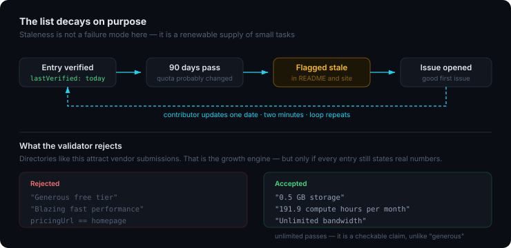

<div align="center">

# Free Tier Radar


<br/>

[](https://github.com/MhmmdFaizal04/free-tier-radar/stargazers)
[](#the-list)
[](https://github.com/MhmmdFaizal04/free-tier-radar/graphs/contributors)
[](CONTRIBUTING.md)

<br/>

> Most free tier lists rot quietly. Quotas get cut, card requirements appear,
> tiers get sunset — and the list keeps saying what was true two years ago,
> which is worse than saying nothing.
>
> **Every entry here carries the date it was last checked.** Anything older
> than 90 days is marked stale in public.

<br/>

[**Browse with filters**](https://mhmmdfaizal04.github.io/free-tier-radar/site/) · [Add a service](#adding-a-service) · [Fix a stale entry](#entries-needing-a-check)

</div>

---

<div align="center">

</div>

---

## At a glance

| | |
|---|---|
| Services listed | **26** |
| No card required | **23** |
| Permanently free | **22** |
| Needing a re-check | **0** |

---

## Entries needing a check

Every entry has been verified in the last 90 days.

---

## The list

### Databases

| Service | Free tier limits | Card | Type | Verified |
|---------|-----------------|------|------|----------|
| **[MongoDB Atlas](https://www.mongodb.com/atlas)** | 512 MB storage<br>Shared RAM and vCPU<br>1 cluster | No | Permanent | `2026-09-05` |
| **[Neon](https://neon.tech)** | 0.5 GB storage<br>191.9 compute hours per month<br>10 branches<br>1 project | No | Permanent | `2026-09-05` |
| **[Supabase](https://supabase.com)** | 500 MB database<br>1 GB file storage<br>5 GB bandwidth<br>50,000 monthly active users<br>2 projects | No | Permanent | `2026-09-05` |
| **[Turso](https://turso.tech)** | 5 GB total storage<br>500 databases<br>1 billion row reads per month | No | Permanent | `2026-09-05` |
| **[Upstash](https://upstash.com)** | 256 MB storage<br>500,000 commands per month<br>Unlimited databases | No | Permanent | `2026-09-05` |

> **MongoDB Atlas** — Shared cluster performance varies with neighbours on the same host
> **Neon** — Compute scales to zero after 5 minutes idle, so the first query after a pause is slower
> **Supabase** — Projects pause after 7 days of inactivity and need a manual restart

### Hosting & Compute

| Service | Free tier limits | Card | Type | Verified |
|---------|-----------------|------|------|----------|
| **[Cloudflare Pages](https://pages.cloudflare.com)** | Unlimited bandwidth<br>500 builds per month<br>100,000 Worker requests per day | No | Permanent | `2026-09-05` |
| **[Fly.io](https://fly.io)** | 3 shared-cpu-1x VMs with 256 MB RAM<br>3 GB persistent volume<br>160 GB outbound transfer | Required | Permanent | `2026-09-05` |
| **[Netlify](https://netlify.com)** | 100 GB bandwidth per month<br>300 build minutes per month<br>125,000 function invocations | No | Permanent | `2026-09-05` |
| **[Railway](https://railway.app)** | $5 credit per month<br>500 execution hours | No | Until threshold | `2026-09-05` |
| **[Render](https://render.com)** | 750 instance hours per month<br>100 GB bandwidth<br>Free Postgres for 90 days | No | Until threshold | `2026-09-05` |
| **[Vercel](https://vercel.com)** | 100 GB bandwidth per month<br>100 GB-hours serverless execution<br>6,000 build minutes per month | No | Permanent | `2026-09-05` |

> **Cloudflare Pages** — Unlimited bandwidth is genuinely unlimited here, which is unusual
> **Fly.io** — Card required at signup even for the free allowance
> **Railway** — Credit resets monthly and does not roll over
> **Render** — Free web services sleep after 15 minutes idle; cold start is roughly 30 seconds
> **Vercel** — Hobby tier forbids commercial use — this catches people out

### AI & LLM APIs

| Service | Free tier limits | Card | Type | Verified |
|---------|-----------------|------|------|----------|
| **[Google AI Studio](https://aistudio.google.com)** | 15 requests per minute on Flash<br>1 million tokens per minute<br>1,500 requests per day | No | Permanent | `2026-09-05` |
| **[Groq](https://groq.com)** | Free tier with per-model rate limits<br>30 requests per minute on most models | No | Permanent | `2026-09-05` |
| **[OpenAI](https://openai.com/api)** | No permanent free tier<br>Trial credit varies by region and account age | Required | Trial only | `2026-09-05` |

> **Google AI Studio** — Free tier prompts may be used for model improvement — read the terms before sending anything sensitive
> **Groq** — Rate limits differ per model and change often — check the docs before relying on them
> **OpenAI** — Listed for completeness — assume you will pay from the first request

### Object Storage

| Service | Free tier limits | Card | Type | Verified |
|---------|-----------------|------|------|----------|
| **[Backblaze B2](https://www.backblaze.com/cloud-storage)** | 10 GB storage<br>1 GB downloads per day<br>2,500 Class B and C transactions per day | No | Permanent | `2026-09-05` |
| **[Cloudflare R2](https://developers.cloudflare.com/r2)** | 10 GB storage per month<br>1 million Class A operations<br>10 million Class B operations | Required | Permanent | `2026-09-05` |

> **Cloudflare R2** — Zero egress cost is the reason to pick this over S3

### Transactional Email

| Service | Free tier limits | Card | Type | Verified |
|---------|-----------------|------|------|----------|
| **[Brevo](https://www.brevo.com)** | 300 emails per day<br>Unlimited contacts | No | Permanent | `2026-09-05` |
| **[Resend](https://resend.com)** | 3,000 emails per month<br>100 emails per day<br>1 custom domain | No | Permanent | `2026-09-05` |

> **Brevo** — Free tier adds Brevo branding to emails

### Authentication

| Service | Free tier limits | Card | Type | Verified |
|---------|-----------------|------|------|----------|
| **[Auth0](https://auth0.com)** | 25,000 monthly active users<br>Unlimited social connections | No | Permanent | `2026-09-05` |
| **[Clerk](https://clerk.com)** | 10,000 monthly active users<br>Unlimited social providers | No | Permanent | `2026-09-05` |

> **Clerk** — Custom domains and SAML need a paid plan

### Monitoring & Errors

| Service | Free tier limits | Card | Type | Verified |
|---------|-----------------|------|------|----------|
| **[Axiom](https://axiom.co)** | 500 GB ingest per month<br>30 day retention | No | Permanent | `2026-09-05` |
| **[Sentry](https://sentry.io)** | 5,000 errors per month<br>10,000 performance units<br>1 user seat<br>30 day retention | No | Permanent | `2026-09-05` |

### CI/CD

| Service | Free tier limits | Card | Type | Verified |
|---------|-----------------|------|------|----------|
| **[GitHub Actions](https://github.com/features/actions)** | Unlimited minutes on public repositories<br>2,000 minutes per month on private repositories<br>500 MB package storage | No | Permanent | `2026-09-05` |

> **GitHub Actions** — macOS runners consume minutes at 10x the Linux rate

### Analytics

| Service | Free tier limits | Card | Type | Verified |
|---------|-----------------|------|------|----------|
| **[PostHog](https://posthog.com)** | 1 million events per month<br>5,000 session recordings<br>1 million feature flag requests | No | Permanent | `2026-09-05` |

### Search

| Service | Free tier limits | Card | Type | Verified |
|---------|-----------------|------|------|----------|
| **[Algolia](https://www.algolia.com)** | 10,000 search requests per month<br>1 million records | No | Permanent | `2026-09-05` |
| **[Meilisearch Cloud](https://www.meilisearch.com/cloud)** | 14 day trial, no permanent free tier | No | Trial only | `2026-09-05` |

> **Meilisearch Cloud** — Self-hosting Meilisearch is free and unlimited

---

## Adding a service

One file, and your pull request cannot conflict with anyone else's.

```jsonc
// data/services/your-service.json
{
  "slug": "your-service",
  "name": "Your Service",
  "url": "https://yourservice.com",
  "pricingUrl": "https://yourservice.com/pricing",
  "category": "database",
  "description": "What the service does. Not what the free tier gives.",
  "limits": [
    "500 MB storage",
    "100 GB bandwidth per month"
  ],
  "creditCardRequired": false,
  "expires": "never",
  "caveats": ["Anything worth knowing before committing to it"],
  "lastVerified": "2026-09-05",
  "verifiedBy": "yourhandle"
}
```

**The limits field is the whole point.** The validator rejects marketing
language — "generous free tier" fails, "500 MB storage" passes. That rule
exists because directories like this attract vendor submissions, and a list
of adjectives helps nobody.

Run `npm run validate` before opening the pull request. It takes a second and
catches everything a reviewer would.

---

## Are vendors welcome?

Yes, listing your own service is fine. Two conditions:

1. The numbers are real and match your pricing page
2. `caveats` mentions anything that would surprise someone — sleep timers,
   commercial-use restrictions, regional limits

An entry that hides a caveat gets removed when someone notices, and someone
always notices.

---

## Why the verification date

A free tier directory without dates is a liability. Someone reads "500 MB
free", plans around it, and discovers on deployment day that it became 100 MB
eighteen months ago.

The date makes the list honest about what it does not know. It also means the
data decaying is not a failure — it is a queue of small, obvious contributions
that anyone can pick up.

---

## Licence

[CC0 1.0](LICENSE) — public domain. Quotas belong to their respective vendors
and change without notice; always confirm on the pricing page before
committing to anything.

---

<div align="center">

<a href="https://github.com/MhmmdFaizal04/free-tier-radar/graphs/contributors">
  
</a>

<br/><br/>

Maintained by [MhmmdFaizal04](https://github.com/MhmmdFaizal04)

<sub>This file is generated. Edit `data/services/`, not this.</sub>

</div>
